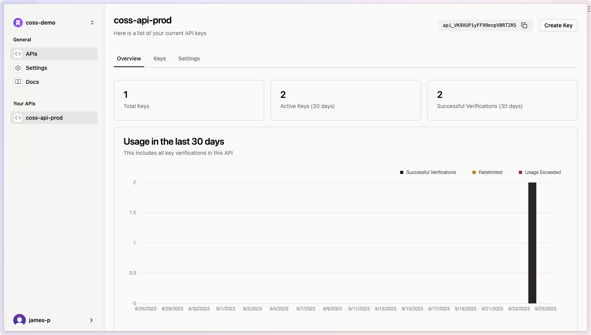
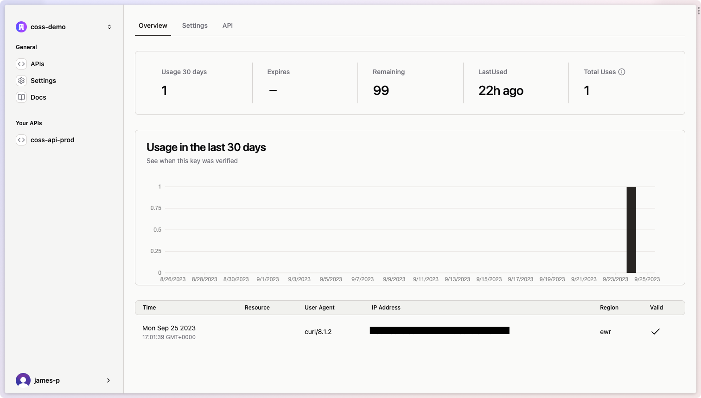

Unkey offers both per key and per API analytics that allow you to drive business decisions.

## Per API Analytics

Our per API analytics offer a broad overview of the usage for a specific API with total keys, active keys and verifications in the last 30 days.

  

## Per Key Analytics

Our per key analytics give you a deep dive into each individual key, giving usage data, key data and where the requests originated from. This data can be useful for finding your top users, and where verifications are coming from.

  
