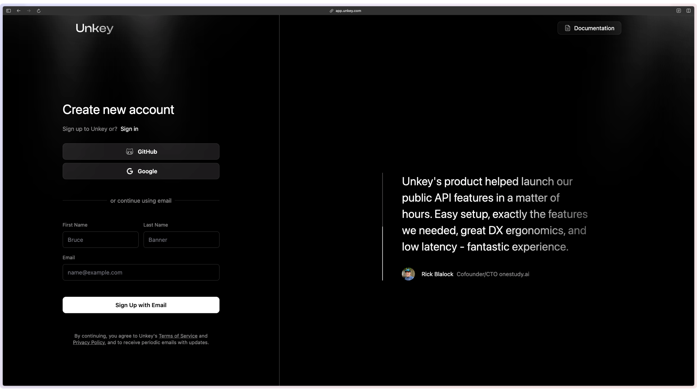
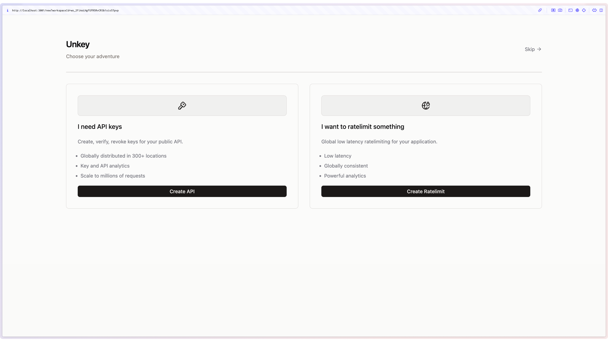
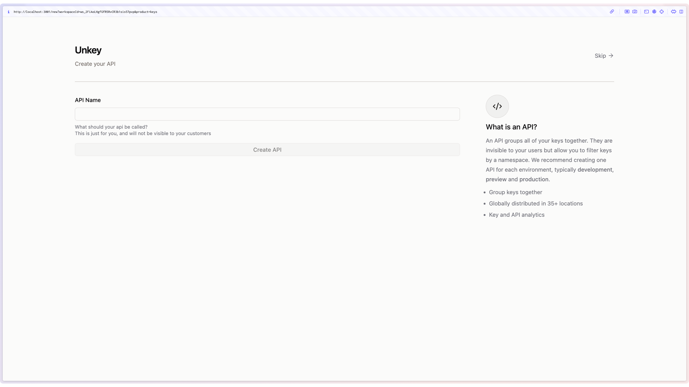
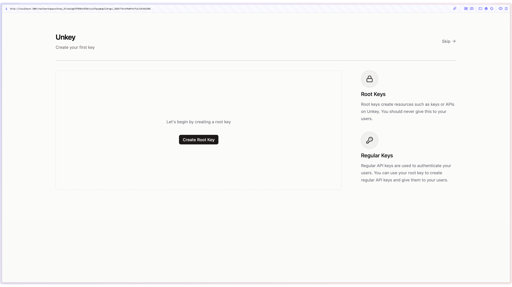

## 1. Create your Unkey account

The first step to using Unkey is to create an account. You can do this by visiting [app.unkey.com](https://app.unkey.com) or by clicking the Dashboard button in the top right of your screen.

  

## 2. Choose how you want to use Unkey

As soon as you create your account you will be asked to choose how you want to use Unkey. Your options are:

- **API Keys**: This is used for protecting your public API.
- **Ratelimiting**: This is global low latency ratelimiting for your application.

> You can of course use both, but for now we'll just choose API Keys.

## 3. Create your first API

Next we will get you to create your first API. This is the API that you will be protecting with Unkey. You can create as many APIs as you like, but for now we'll just create one.

## 4. Follow the Unkey tutorial

Next we will show you the basics of how to use Unkey. You can skip this step if you like, but we recommend you follow along.

## 5. Next Steps

You should get to know our [API reference](/api-reference/authentication), as you can add additonal fields to your request when issuing a key.

You can also check out the [Features](/apis/features/ratelimiting) section for more information on how to use Unkey.
