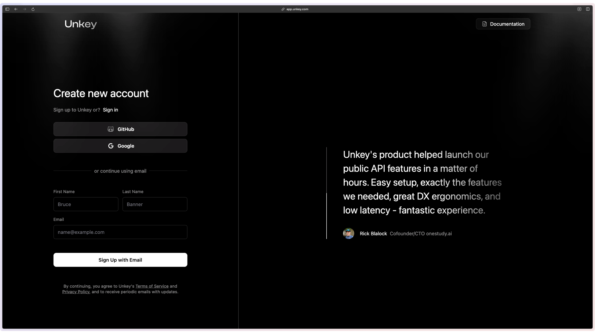

## 1. Create your Unkey account

The first step to using Unkey is to create an account. You can do this by visiting [app.unkey.com](https://app.unkey.com) or by clicking the Dashboard button in the top right of your screen.

## 2. Choose how you want to use Unkey

As soon as you create your account you will be asked to choose how you want to use Unkey. Your options are:

- **API Keys**: This is used for protecting your public API.
- **Ratelimiting**: This is global low latency ratelimiting for your application.

> You can of course use both, but for this choose Ratelimiting.

## 3. Follow the Unkey tutorial

Next we will show you the basics of how to use Unkey Ratelimiting. You can skip this step if you like, but we recommend you follow along.

## 4. Next Steps

You should get to know our [API reference](/api-reference/ratelimits/limit), as you can add additonal fields to your request when ratelimiting endpoints.
